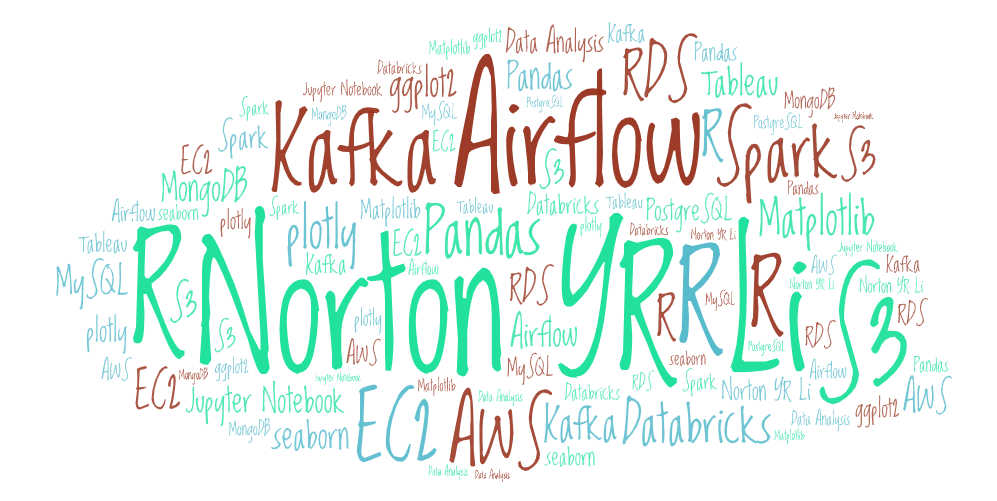
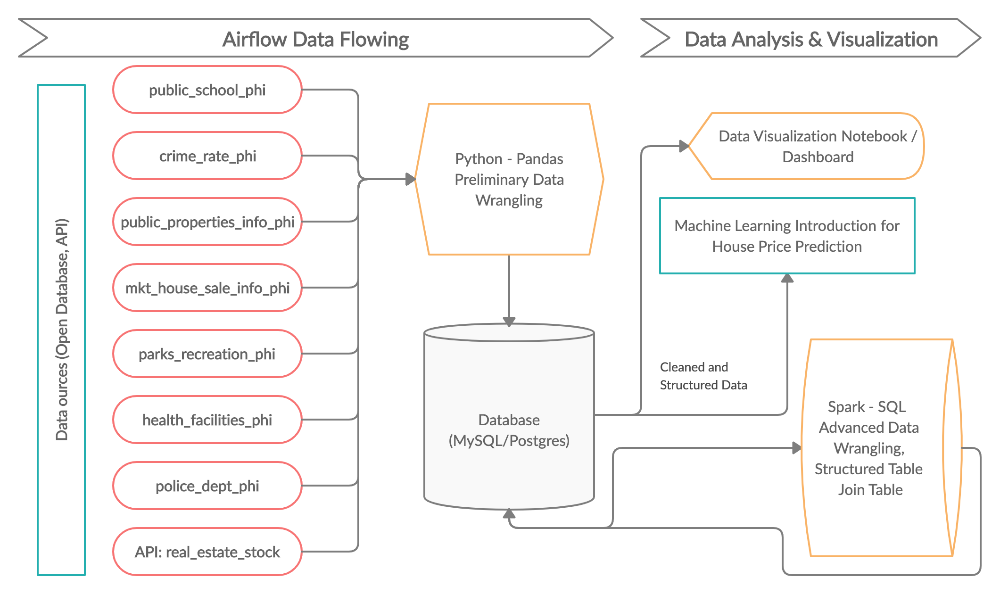
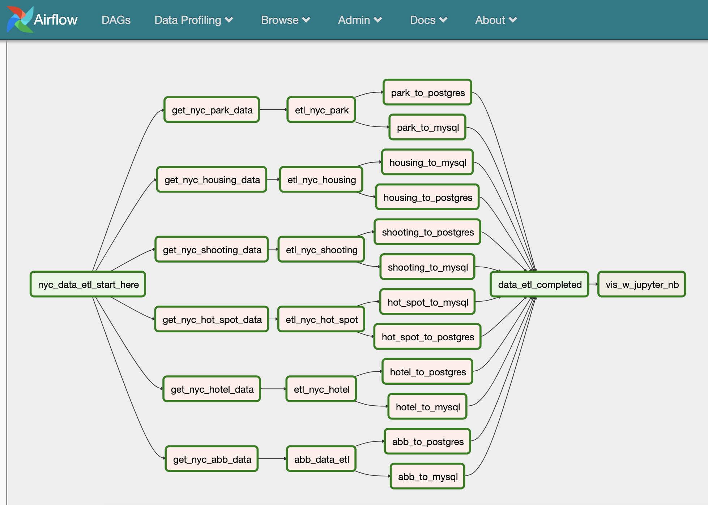
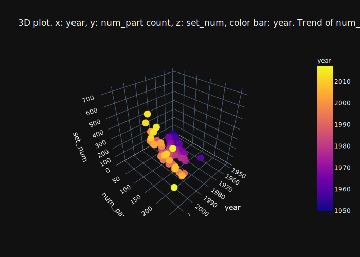
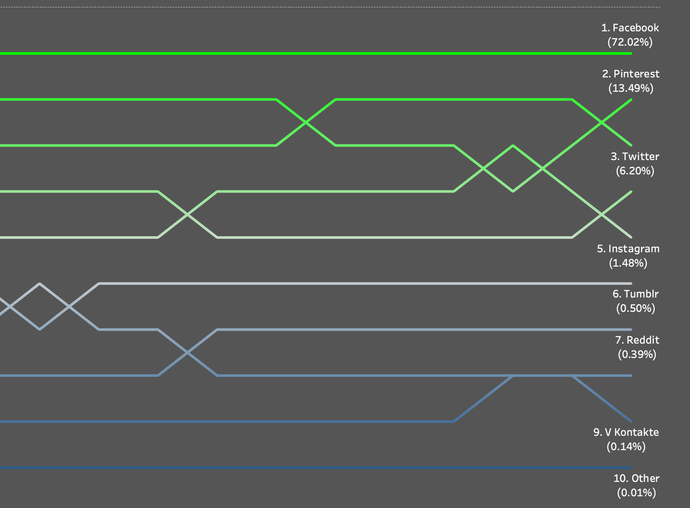

### [Data Group Project: Non-Traditional Housing Price Predictor in Philadelphia*](https://github.com/nortonlyr/ZCW.DataGroupProject)   

- View the project report at (https://app.luminpdf.com/viewer/5ecc6da18124240012ae0885)
- [Group Project Cover Page](https://malbt.github.io/ZCW.DataGroupProject/) 
- [Tableau Dashboard for Philadelphia House Price Data Visualization](https://public.tableau.com/profile/norton.li#!/vizhome/Philly_House_Vis_Dashboard/Dashboard1?publish=yes)
- Data Collection: Airflow
- Data Cleaning: Pandas
- Data Storage: MySQL
- Data Transformation (Join Table): Spark(SQL) Cluster @ Databricks  
- Data Visualization: Jupyter Notebook: Matplotlib -> (heatmap), seaborn -> (pairplot, boxplot), plotly -> (3D plot); Tableau: dashboard

  

---
### [Airflow Pipeline: New York City Airbnb Selection](https://github.com/nortonlyr/DataEngineering.Labs.AirflowProject)

- Airflow
- Pandas
- MySQL / PostgreSQL
- Jupyter Notebook Report
- AWS (S3, EC2, RDS)

---
### [Alternative Data Engineering Tools Research](https://github.com/nortonlyr/Week9-ResearchProjects)  

- Language: R
- NoSQL Database: MongoDB
- Visualization Tools: ggplot2, plotly -> (3D plot)
- In this project, I applied both R-Studio and jupyter notebook to import and export data from MongoDB, and then used ggplot2 and plotly to demonstrate data visualization, respectively.
  

---
### [Black Jack Game](https://github.com/nortonlyr/PythonFundamentals.Labs.BlackJack)   
  
- PyCharm
- Classes 
- Terminal
- Unit Testing 

---  

---
### [Tableau Public Data Visulization](https://public.tableau.com/profile/norton.li#!/)   
  
- [Social Media Top 10 (05/19 -05/20)](https://public.tableau.com/profile/norton.li#!/vizhome/Social_Media_19to20_Vis01/Social_Media_19to20_Vis_01)

---  

(* *Project still on going*)
  
